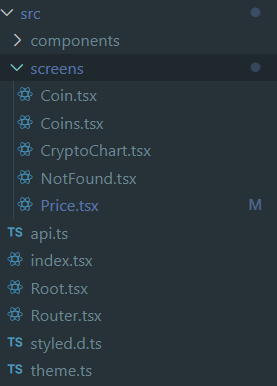
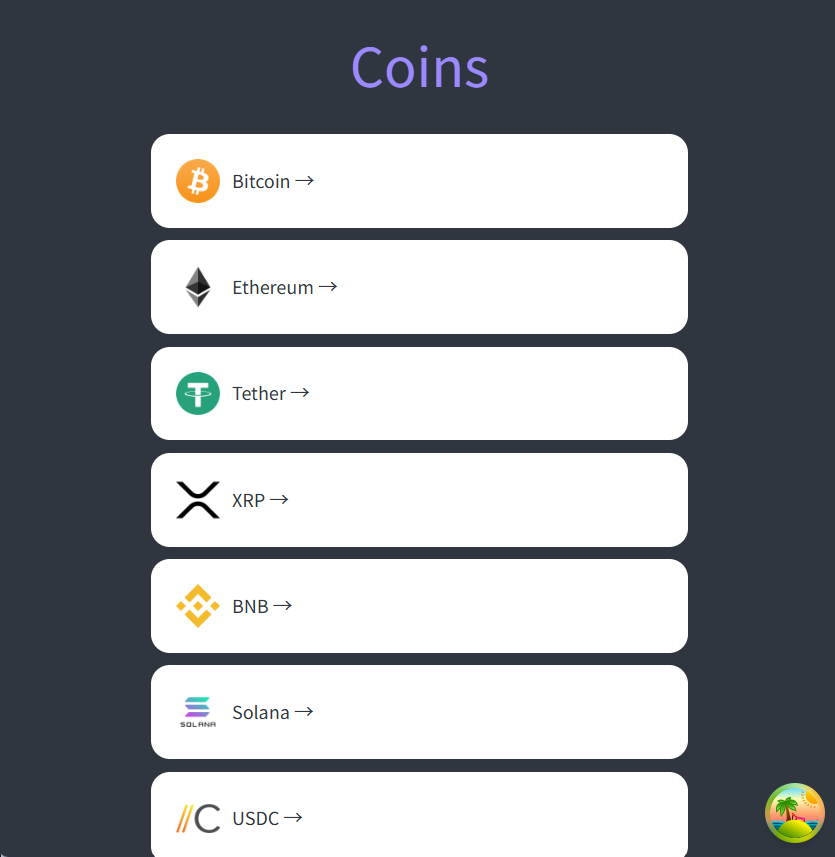
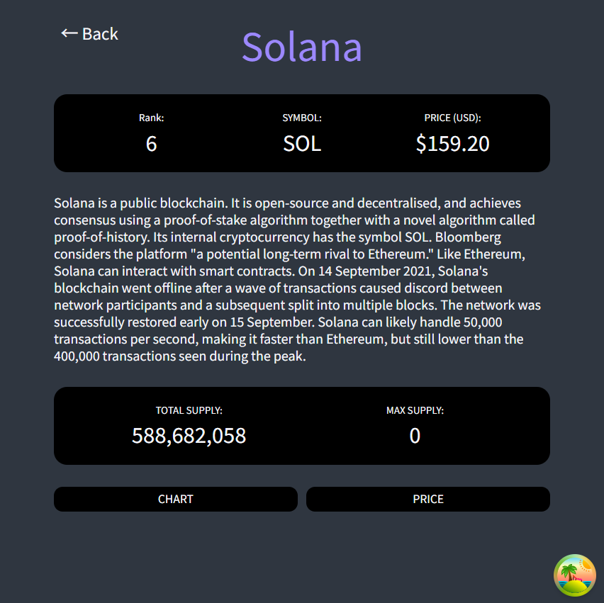
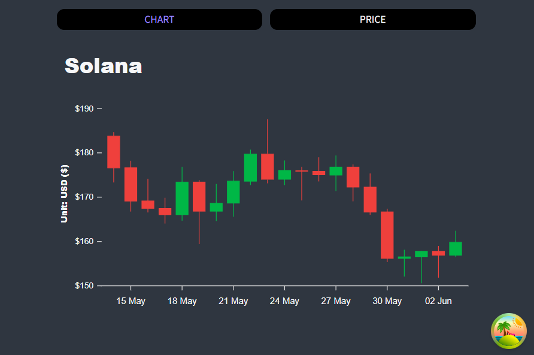
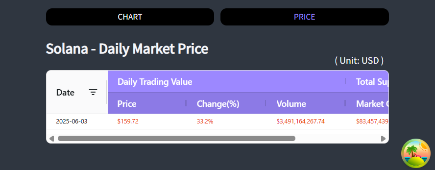

# Crypto Tracker

<video controls src="./Crypto Tracker.mp4" title="Crypto Tracker" width=400></video>

<br>

## Used Version

- react@19.1.0
- styled-components@6.1.18
- react-router-dom@7.6.1
- @tanstack/react-query@5.79.0
- @tanstack/react-query-devtools@5.79.0
- apexcharts@4.7.0
- react-helmet@6.1.0
- apex-grid@1.0.1
- ag-grid-react@33.3.1

> - `@tanstack/react-query` Official Docs: [https://tanstack.com/query/latest/docs/framework/react/quick-start](https://tanstack.com/query/latest/docs/framework/react/quick-start) <br>
> - `APEXCHARTS` Official Docs: [https://apexcharts.com/docs/installation/](https://apexcharts.com/docs/installation/) > `AG-Grid` Official Docs: [https://www.ag-grid.com/](https://www.ag-grid.com/)
> - **Coinpaprika API**: [https://api.coinpaprika.com/](https://api.coinpaprika.com/)

<br>

## Installation

```
npx create-react-app [App Name] --template typescript

npm i --save-dev @types/styled-components
npm i styled-components

npm i react-router-dom
npm i @tanstack/react-query

npm install --save react-apexcharts apexcharts

npm i react-helmet
npm i --save-dev @types/react-helmet

npm install apex-grid @lit-labs/react

npm install ag-grid-react
```

<br>

## Structure



<br>

- Routing

```
const Router = createBrowserRouter([
    {
        path: "/",
        element: <Root />,
        children: [
            {
                path: "",
                element: <Coins />,
                errorElement: <ErrorComponent />
            },
            {
                path: ":coinId",
                element: <Coin />,
                children: [
                    {
                        path: "price",
                        element: <Price />
                    },
                    {
                        path: "chart",
                        element: <CryptoChart />
                    }
                ]
            },
        ],
        errorElement: <NotFound />
    }
])
```

<br>

## Result

- **Home Screen**


<br><br>

- **Detailed Information of a specific coin**


<br><br>

- **Chart**


<br><br>

- **Table**


<br><br>

<br>
<br>
<br>
